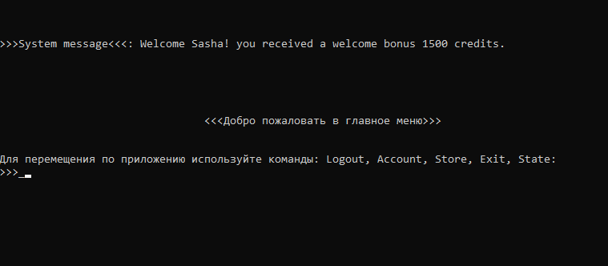

# Игра

Тестовое консольное клиент серверное приложение

## Запуск приложения
Команда:
```bash
docker compose run --rm -it prepare
```
Запускает сервер. При первом запуске необходимо выполнить с флагом "prepare", что бы наполнить БД данными.

Последующие запуски сервера:
```bash
docker compose run --rm -it
```
Запуск клиента:
```bash
docker compose run --rm -it client
```
Запускать в новом окне столько раз сколько клиента необходимо запустить.

Остановка сервера (без очистки данных):
```bash
docker compose stop
```
Удаление контейнеров (с потерей данных БД):
```bash
docker compose down
```

## Пользовательские сценарии
Меню регистрации, от пользователя ожидается имя или команда на завершение сценария.

После логина, пользователь переходит в главное меню. 
Главное меню позволяет перейти в личный кабинет и магазин приложения. Команды logout и exit
Новый пользователь сохраняется сервером в БД и начисляет приветственный бонус. 

Существующий пользователь логинится и приветствуется системой


Магазин приложения


При первом входе в магазин приложения с сервера загружается список продуктов доступных к покупке.

Для совершении покупки необходимо указать Id желаемых продуктов.


После обработки запроса на покупку сервер системным сообщением ответит о статусе покупки.

Аккаунт пользователя.
Отображает текущий баланс пользователя, список имеющегося имущества.
Позволяет пользователю пополнить балас и продать имущество.

Для продажи имущества необходимо указать Id желаемых продуктов.

После обработки запроса сервер от сервера получаем системное сообщение о статусе операции

При отсутствии у пользователя имущества будет выведено сообщения о возможности покупки в магазине.

Для пополнения баланса не обходимо ввести команду на пополнение баланса

После выполнения транзакции, сервер пришлет системное уведомление и новый баланс пользователя. 


При завершении клиенской сессии и повторном запуске клиента, у сервера запрашиваются данные о пользователе 
и в приложении отображаетсяактуальная информация. 


